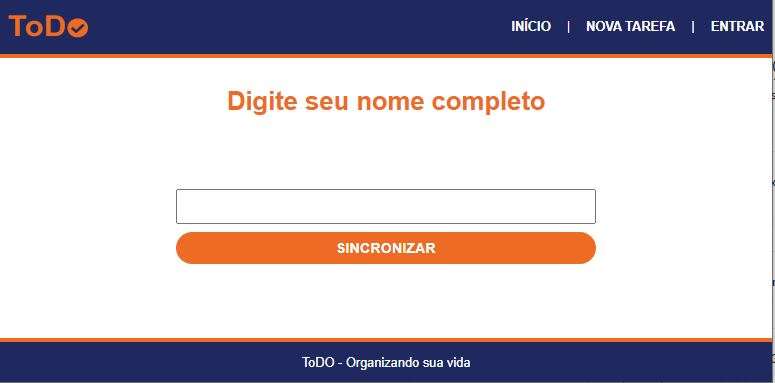
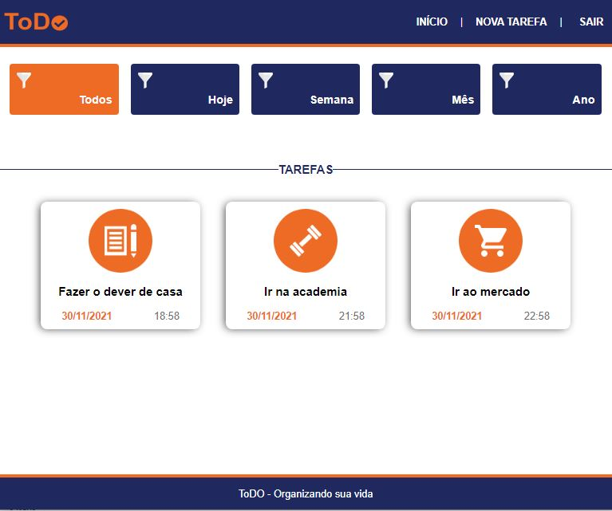
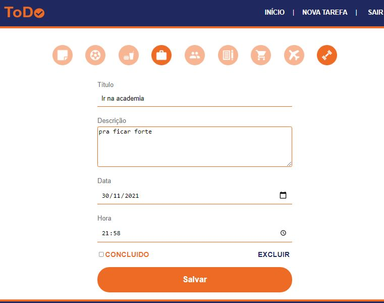

<h1 align="center">ToDo List</h1>  

<h2 align="center">A ToDo list made with NodeJS, MongoDB and ReactJS.</h2>
 
<h2>How to run this Project</h2>
 
    - Clone the project

  
 
    - Go to "backend" folder and install the NodeJS modules using: <b>npm install</b> 

 
    - Create and Set the config.env with a 'MONGO_URI' variable with your database MongoDB database URI

 
    - Run command: <b>npm start</b>
 

 
    - Go to "web" anb run <b>npm start</b> 

 
    - Wait the Project open in the browser
 
 
 

  

<h3 align="center">- Simple input to Store your data -</h3>

  

  
<h3 align="center">- Show all your tasks or filter them by day, week, month or year -</h3>

  

  
<h3 align="center">- Edit or Delete your tasks-</h3>

  

